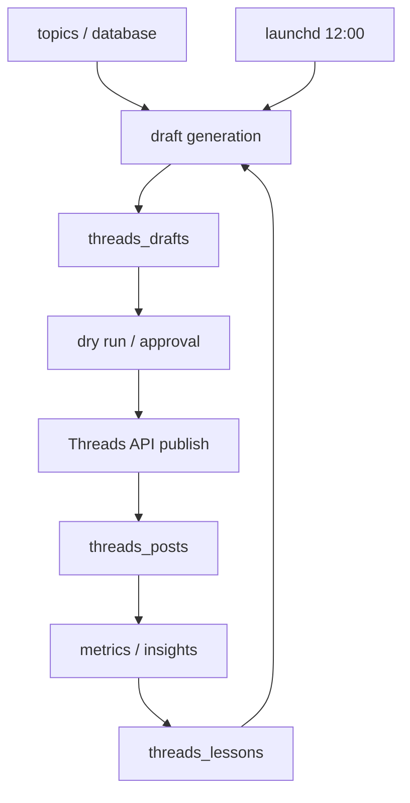
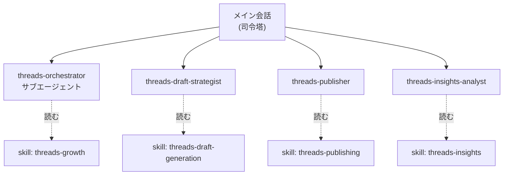

# 講義ガイド: Threads自動運転システム（Claude Code版）

## 伝えたいこと

この仕組みは「AIが勝手にSNS投稿する魔法」ではなく、以下を分離した運用システム。

1. 人格と方針（`.claude/skills` `.claude/agents`）
2. 下書き生成（`scripts/generate-drafts.mjs`）
3. 承認と投稿（`scripts/threads-publish-draft.mjs`）
4. 投稿履歴の記録（`data/threads-posts.json`）
5. 反応データからの改善（`data/threads-performance.json`）
6. スケジューラーによる毎日実行（`launchd/`）

## 全体図



## Claude Code の役割分担図



> ポイント: Claude Codeのサブエージェントは別サブエージェントを起動できない。
> だから「3体を順に呼ぶ」司令塔役はメイン会話が担う。
> 1つのエージェントに丸ごと任せたいときだけ `threads-orchestrator` を使う。

## 講義で見せる順番

1. `data/topics.json` を見せる
2. `npm run threads:drafts` を実行する
3. `data/threads-drafts.json` の `strategy` / `hypothesis` / `metadata` を見せる
4. `npm run threads:publish` でドライランを見せる
5. `scripts/threads-publish-draft.mjs` の安全装置を見せる
6. `.claude/skills/` と `.claude/agents/` で役割分担を見せる
7. 会話で「Threadsの日次運用を回して」と頼み、司令塔→3役割の流れを見せる
8. `launchd/` で毎日実行できることを説明する

## 講義の要点

- 自動化は「投稿する」より「同じ失敗を繰り返さない」ことが重要
- 投稿文だけでなく、仮説とメタデータを保存する
- 投稿履歴を読ませることで同じ内容の連投を防ぐ
- live投稿はデフォルトOFFにする
- tokenはコードではなく `.env.local` やSecretsに置く
- launchdはMacが起動している時だけ動く。サーバー運用ならcronやCloud Schedulerへ
- **Codex版との対比**: 同じ運用思想を、ツールごとの「定義の置き場所」に合わせて移植できる
- **メトリクス分析は「半分だけ」実装済み**: 集計ロジック（generate-drafts.mjs）と
  読み込み先（threads-performance.json）はあるが、API取得スクリプトは未実装。
  `data/threads-performance.json` はデモ用の架空サンプル。「ここが受講者が次に作る部分」として見せると良い

## デモコマンド

```bash
cd training/threads-automation-claude
npm run check
npm run threads:drafts
npm run threads:publish
```

## Live投稿デモをする場合

実投稿は講義中に誤爆しやすいので、基本はドライラン推奨。

やる場合だけ:

```bash
cp .env.example .env.local
# .env.localに実tokenを書く
npm run threads:me
npm run threads:publish -- --skip-posted --skip-today --live
```
